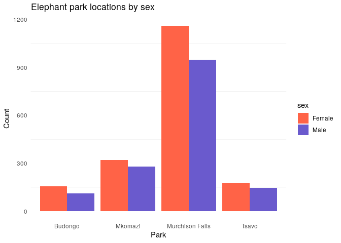

<!-- README.md is generated from README.Rmd. Please edit that file -->

<!-- You'll still need to render `README.Rmd` regularly, to keep `README.md` up-to-date. `devtools::build_readme()` is handy for this.  -->

# Elephants

<!-- badges: start -->

<!-- badges: end -->

The goal of the “elephants” package is to provide a dataset involving
elephants\! The dataset can be used for data exploration, visualization,
and statistical analysis. For example, what parks were the elephants
primarily located in and what sex were these elephants?

## Example

``` r
library(tidyverse)
#> ── Attaching packages ─────────────────────────────────────── tidyverse 1.3.0 ──
#> ✓ ggplot2 3.3.3     ✓ purrr   0.3.4
#> ✓ tibble  3.0.4     ✓ dplyr   1.0.2
#> ✓ tidyr   1.1.2     ✓ stringr 1.4.0
#> ✓ readr   1.4.0     ✓ forcats 0.5.0
#> ── Conflicts ────────────────────────────────────────── tidyverse_conflicts() ──
#> x dplyr::filter() masks stats::filter()
#> x dplyr::lag()    masks stats::lag()
library(elephants)

elephants %>%
  filter(sex == "Female" | sex == "Male" ) %>%
  ggplot(mapping = aes(x = park, fill = sex)) +
    geom_bar(position = "dodge") +
    scale_fill_manual(values = c("tomato", "slateblue")) + 
    theme_minimal() +
    theme(panel.border = element_blank(),
      panel.grid.major = element_blank())  +
    labs(x = "Park", y = "Count", title = "Elephant park locations by sex")
```



We can see that the majority of elephants were located in Murchison
Falls, with a slightly greater amount of females in each park.

## Installation

The development version of “elephants” is available from
[GitHub](https://github.com/) with:

``` r
# install.packages("devtools")
devtools::install_github("https://github.com/Reed-Math241/pkgGrpc")
```
